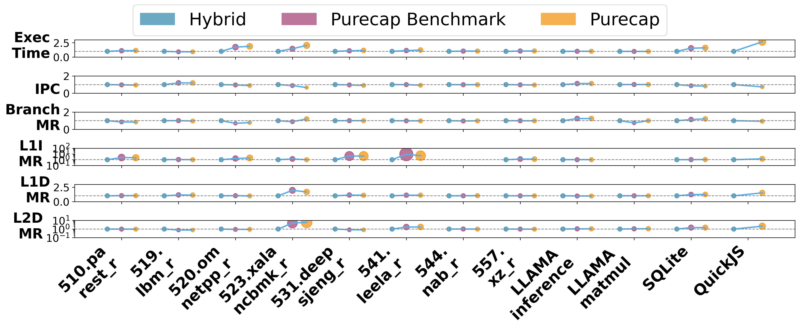
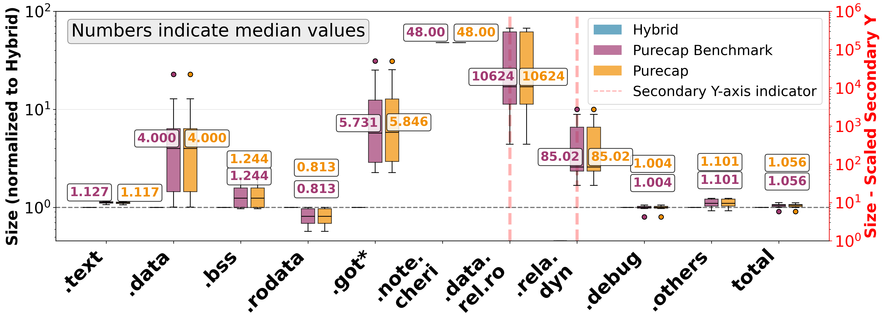
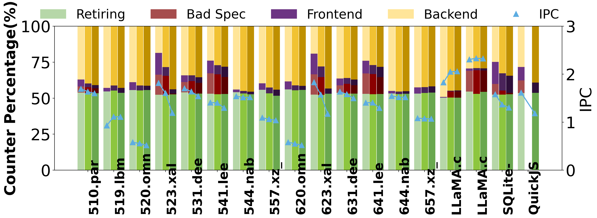
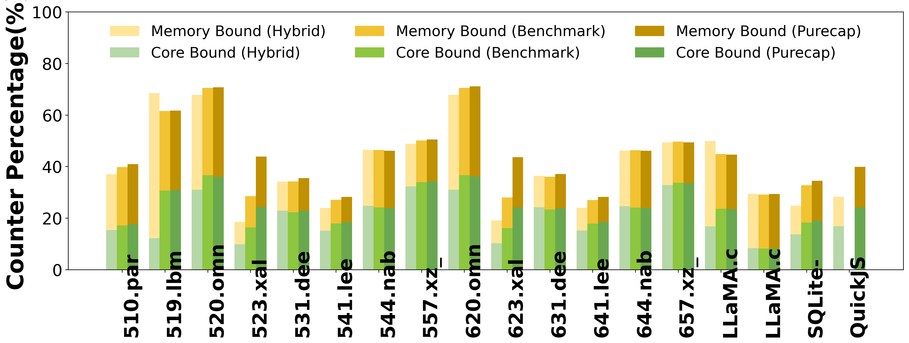
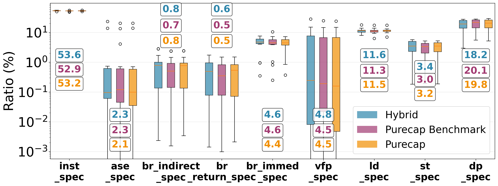
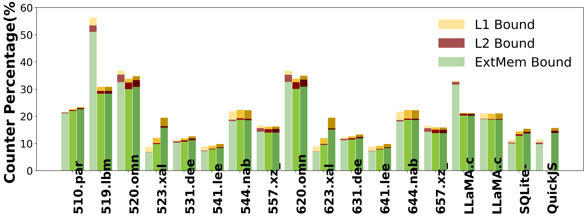
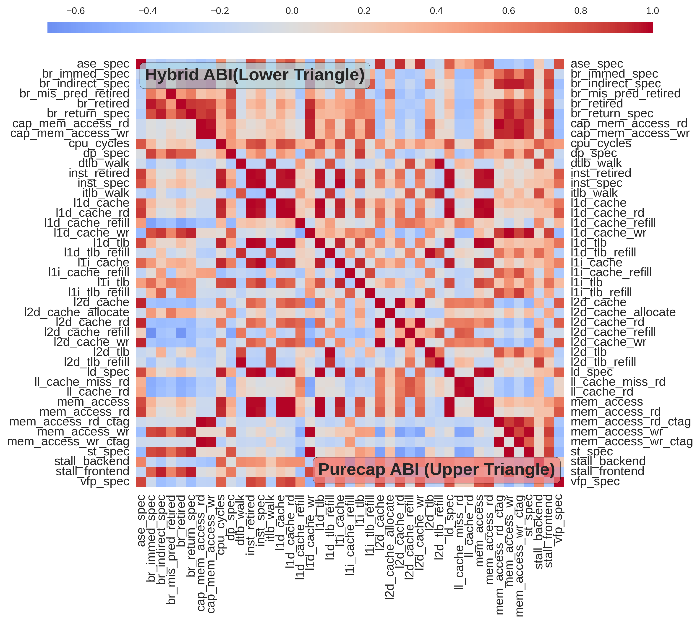
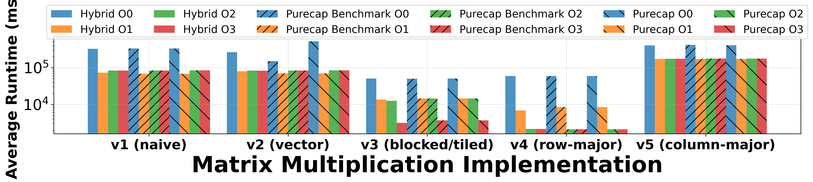

[](https://doi.org/10.5281/zenodo.16923143)

# Artifact Evaluation (AE) for ``Sweet or Sour CHERI: Performance Characterization of the Arm Morello Platform", IISWC 2025.

This repository contains the artifacts and workflows necessary to reproduce the experimental results and figures presented in the IISWC 2025 paper by X. Sun, J. Singer, and Z. Wang. 

**Sweet or Sour CHERI: Performance Characterization of the Arm Morello Platform**

Capability Hardware Enhanced RISC Instructions (CHERI) offer a hardware-based approach to enhance memory safety by enforcing strong spatial and temporal memory protections. This paper presents the largest performance analysis of the CHERI architecture on the ARM Morello platform seen to date. Using on-chip performance monitoring counters (PMCs), we evaluate 20 C/C++ applications, including the SPEC CPU2017 suite, SQL database engine, JavaScript engine, and large language model inference, across three CHERI Application Binary Interfaces (ABIs). 

Our results show that performance penalties of CHERI range from negligible to 1.65x, with the most significant impact apparent in pointer-intensive and memory-sensitive workloads. These overheads are primarily caused by increased memory traffic and L1/L2 cache pressure from 128-bit capabilities. However, our projections suggest that these overheads can be significantly reduced with modest microarchitectural changes, and that a mature, optimized implementation could achieve memory safety with minimal performance impact. We hope these findings provide valuable guidance for the design of future, performance-optimized memory security features.

## How to reproduce the experiment resutls?

**Option-1: An interactive jupyter notebook.**

We have provided an interactive Jupyter notebook running on a preconfigured machine to make the review process easier and more straightforward. The environment and dependencies are already set up, and all scripts, along with their descriptions, are well-prepared to enable reviewers to easily reproduce the results of the submitted paper.

Jupyter link and password: seen in `artifact appendix` PDF file in [AE submission](iiswc2025ae.hotcrp.com)

**Option-2: Reproducing experiments from scratch using source files.**

Reviewers may also deploy the runtime environment directly from the source files, provided they have the necessary hardware resources. The following section outlines the steps required to reproduce the experiments from source.

---

## Pre-requisites

### Hardware 
- [ARM Morello prototype board](https://www.arm.com/architecture/cpu/morello) running [CheriBSD 25.03](https://www.cheribsd.org/).
- Intel-based machine running Ubuntu 22.04 LTS for cross-compilation.

### Software dependencies
- [cheribuild commit:b529760afc01d9e](https://github.com/CTSRD-CHERI/cheribuild).
- Python 3.10, git, ssh, autoconf, automake, etc. 
- All remaining dependencies, including [morello/llvm-project](https://git.morello-project.org/morello/llvm-project.git), compiled with [cheribuild](https://github.com/CTSRD-CHERI/cheribuild).

All of the above software dependencies can be installed on Ubuntu with the following command:
```bash
$ sudo apt update 
$ sudo apt install autoconf automake libtool pkg-config clang bison cmake mercurial ninja-build samba flex texinfo time libglib2.0-dev libpixman-1-dev libarchive-dev libarchive-tools libbz2-dev libattr1-dev libcap-ng-dev libexpat1-dev libgmp-dev bc

$ cd ~ && git clone https://github.com/CTSRD-CHERI/cheribuild.git 
$ cd ~/cheribuild 
$ ./cheribuild.py all-morello-purecap # manually reboot machine after this.
```

### Benchmark licenses
Users must obtain a license prior to executing the following benchmarks: 
- [SPEC CPU 2017 benchmark](https://www.spec.org/cpu2017/)

## Reproducing experimental results and figures

The detailed instructions for running these benchmarks are documented in [./speccpu/README](./speccpu/readme.md), [./sqlite-bench/README](./sqlite-bench/readme.md), [./quickjs/README](./quickjs/readme.md), and [./llama-cpp/README](./llama-cpp/readme.md), respectively.

These scripts reproduce the experiments corresponding to Figures 1–8 and Tables 3–4 in the paper. The binaries are compiled on an Intel-based development machine (x86) and subsequently transferred to and executed on a Morello machine (ARMv8). 

PS: The scripts are not designed to perform repeated executions. Users should manually run the following multiple times to obtain average values. 

PS: Please configure the SSH authentication bypass password auth between the development machine and Morello in advance.

If you encounter any unexpected behavior, please report it freely.

### Step1. Cross-compile benchmarks
```bash
# SPEC CPU 2017
./speccpu/cross-compile/compile all
# SQLite
./sqlite-bench/cross-compile/compile
# QuickJS
./quickjs/cross-compile/compile
# LLaMA.cpp
./llama-cpp/cross-compile/compile
# Matrix Multiply
./matrix-multiply/cross-compile/compile
```

PS: The download process for these benchmarks, along with automated fixes for compilation issues, has been documented in the corresponding README files and incorporated into the provided Linux shell scripts.

### Step2. Setup and distribute binaries to Morello
```bash
# SPEC CPU 2017
./speccpu/run/setup && ./speccpu/run/distribute <morello ip> 
# SQLite
./sqlite-bench/run/setup && ./sqlite-bench/run/distribute <morello ip> 
# QuickJS
./quickjs/run/setup && ./quickjs/run/distribute <morello ip> 
# LLaMA.cpp
./llama-cpp/run/setup && ./llama-cpp/run/distribute <morello ip> 
# Matrix Multiply
./matrix-multiply/run/setup && ./matrix-multiply/run/distribute <morello ip> 
```

PS: We collected PMU data using the `PMCSTAT` tool provided in CheriBSD. Since the Neoverse N1 PMU supports only a limited number of configurable counters (typically six), each benchmark was executed multiple times, nine runs in total, to capture the full set of desired PMU events. The provided `setup` scripts facilitate this process by generating `launch` scripts that run each benchmark multiple times.

### Step3. Validate binaries 
```bash
# SPEC CPU 2017
./speccpu/run/check-abi <morello ip> 
# SQLite
./sqlite-bench/run/check-abi <morello ip> 
# QuickJS
./quickjs/run/check-abi <morello ip> 
# LLaMA.cpp
./llama-cpp/run/check-abi <morello ip> 
# Matrix Multiply
./matrix-multiply/run/check-abi <morello ip> 
```

Ensuring that the compiled binaries in the `hybrid`, `purecap`, and `purecap benchmark` ABIs are generated correctly

### Step4. Execute benchmarks 
```bash
# SPEC CPU 2017
./speccpu/run/launch <morello ip> <result-folder: ./results/speccpu>
# SQLite
./sqlite-bench/run/launch <morello ip> <result-folder: ./results/sqlite-bench>
# QuickJS
./quickjs/run/launch <morello ip> <result-folder: ./results/quickjs>
# LLaMA.cpp
./llama-cpp/run/launch <morello ip> <result-folder: ./results/llama-cpp>
# Matrix Multiply
./matrix-multiply/run/launch <morello ip> <result-folder: ./results/llama-cpp>
```

PS:  The `result-folder` resides on the development machine, and the results generated on Morello are automatically transferred back upon completion. 

### Step5. Analyze and visualize results 

The first step is to extract and consolidate identical metrics from multiple profiling files for each benchmark, reorganizing them into a standardized format. This is accomplished using the following scripts.

```bash
# SPEC CPU 2017
./speccpu/run/verbose-list
# SQLite
./sqlite-bench/run/verbose-list
# QuickJS
./quickjs/run/verbose-list 
# LLaMA.cpp
./llama-cpp/run/verbose-list
# Matrix Multiply
./matrix-multiply/run/verbose-list


```

PS: Reviewers may undertake additional analyses or modify the source code as necessary to conduct further performance evaluations. 

The following section details the procedures for generating the figures presented in the submitted paper.

#### 5.1 The overall execution performance (Figure 1)
```bash
cd ./overleaf
python ./figure1-macroscopic-performance.py
```


This figure highlights the high variability of runtime overhead in purecap mode across different workloads. In some cases, CHERI features incur no measurable overhead and can even yield modest performance improvements, as observed in the 519.lbm_r and LLaMA matmul benchmarks, (§4.1).


#### 5.2 The distribution of program section sizes (Figure 2)
```bash
cd ./overleaf
python ./figure2-macroscopic-binary-size.py
```


This figure illustrates the impact of the three ABI modes on binary size across different program sections. We use the hybrid ABI as the baseline and normalize the sizes of the purecap and purecap benchmark binaries relative to it. Overall, CHERI capability metadata introduces roughly a 5% increase in total binary size, though the magnitude of the overhead varies substantially across sections, (§4.2).


#### 5.3 The top-level breakdown analysis (including Retiring, Bad Spec, Frontend, Backend, along with IPC) (Figure 3)
```bash
cd ./overleaf
python ./figure3-top-level.py
```


To identify where CPU cycles are spent or wasted, we applied a Top-Down analysis, classifying pipeline slots into four categories: Retiring, Bad Speculation, Frontend Bound, and Backend Bound, (details in §4.4).

#### 5.4 The percentage of counters pretaining to core and memory bounds (Figure 4)
```bash
cd ./overleaf
python ./figure4-backend-level.py
```


Backend stalls arise when the execution units or memory subsystem cannot keep pace with the Frontend. As shown in this figure, the higher stall rates observed in purecap modes are primarily attributable to memory hierarchy effects, in particular elevated L1I, L1D, L2D, and TLB miss rates, (§4.6).

#### 5.5 The distribution of speculative instrution ratios across benchmarks by ABIs (Figure 5)
```bash
cd ./overleaf
python ./figure5-spec-instructions-ratio-boxplot.py
```



This figure reveals a pronounced shift under purecap execution. The proportion of data-processing instructions (DP_SPEC) increases substantially, ranging from 5.21% to 29.31%, reflecting the additional arithmetic operations required for capability manipulation and bounds checking. By contrast, the proportions of load (LD_SPEC) and store (ST_SPEC) instructions remain relatively stable, with standard deviations of 2.01% and 1.47%, respectively. These results suggest that memory access patterns are largely unaffected, while computational demands increase significantly. The observed shift highlights the microarchitectural cost of CHERI’s security model and points to potential opportunities for optimization, (§4.6).


#### 5.6 The detailed memory bound analysis from cache and DRAM (Figure 6)
```bash
cd ./overleaf
python ./figure6-memory-level.py
```


The CHERI architecture’s 128-bit capabilities fundamentally reshape the memory footprint of applications, particularly those that are pointer-intensive or manage large pointer-based data structures. This, in turn, has direct implications for cache efficiency and TLB performance, (§4.7).


#### 5.7 The performance metrics correlation matrix (hybrid vs purecap) (Figure 7)
```bash
cd ./overleaf
python ./figure7-metric-correlation.py --chart-type  combined
```


The increase in CAP_MEM_ACCESS_RD directly drives the rise in L1I miss rates, demonstrating that performance degradation stems from the additional capability memory operations introduced by CHERI. While MEM_ACCESS_RD_CTAG records tag-dependent memory accesses without explicitly capturing tag-check latency—likely pipelined with memory operations—the high frequency of these events confirms heavy reliance on CHERI’s memory protection mechanisms. More fundamentally, CHERI’s safety guarantees and capability manipulations enforce a tightly coupled execution pattern that binds instruction-level behavior to memory system performance. This coupling manifests in the strong correlations among cache refills, TLB walks, and stall cycles, (§4.8).

#### 5.8 The impact of compiler optimization levels (Figure 8)
```bash
cd ./overleaf
python ./figure8-optimization-impact.py
```


The impact of compiler optimization flags (-O) varies across ABIs. We evaluated five versions of a matrix multiplication implementation. In version two, purecap mode incurs significant overhead at -O0, minimal overhead at -O3, and achieves its best performance at -O1. These results suggest that traditional compiler optimization strategies may need to be reconsidered in the CHERI context,  (§4.9).